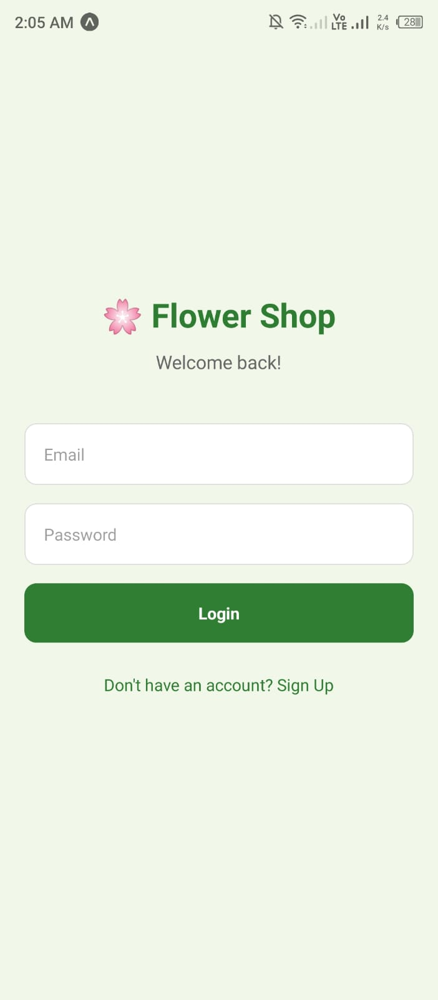
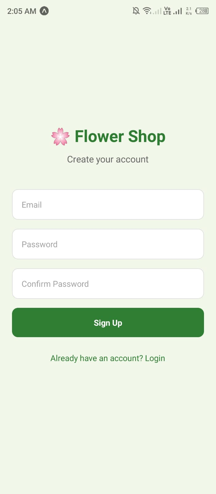
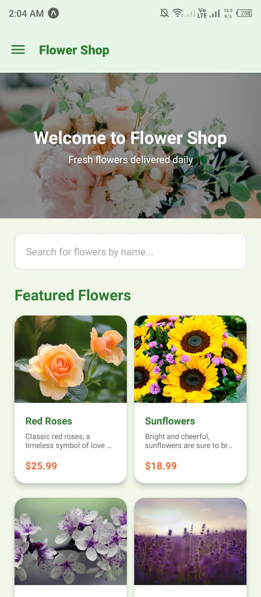
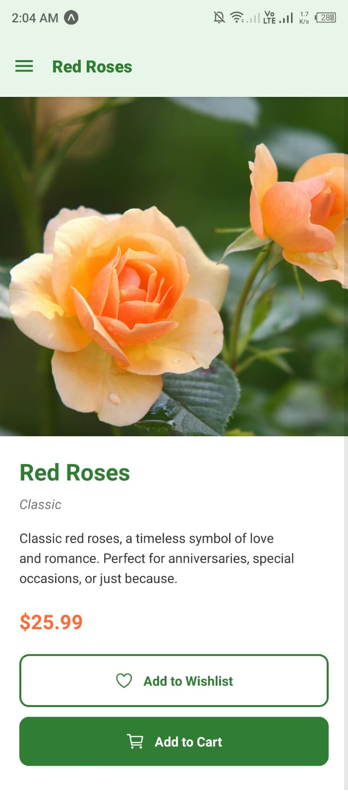
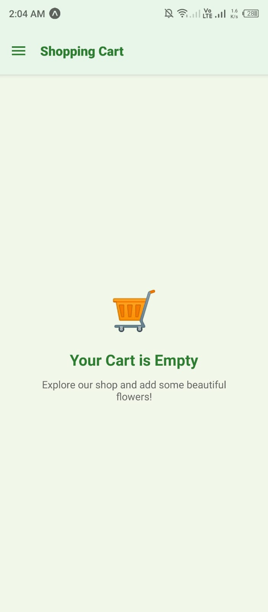
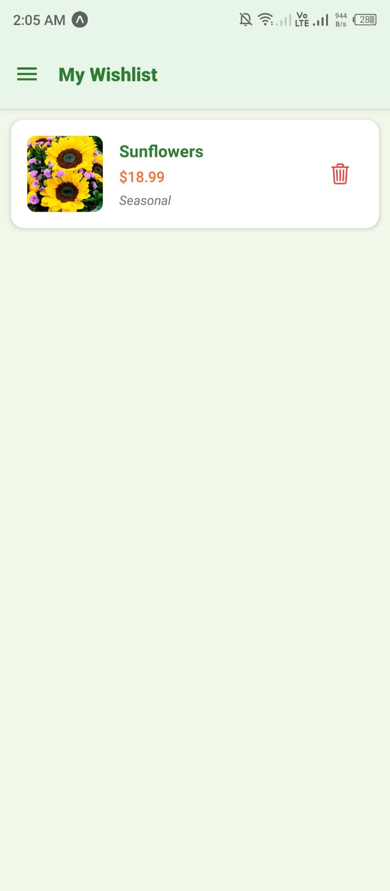
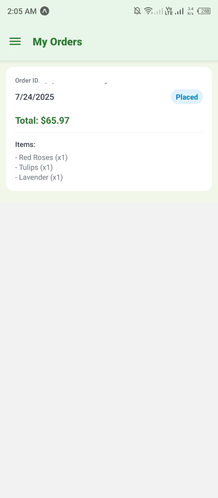
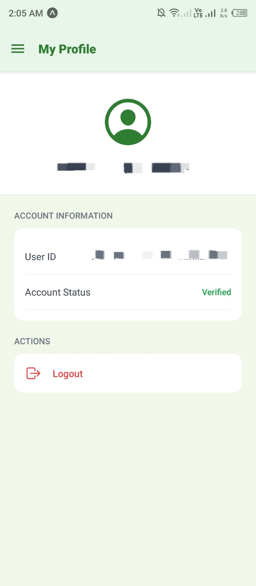

#  Flower Shop - A React Native E-Commerce App


A beautiful and fully functional mobile e-commerce application for a flower shop, built with **React Native** and powered by a complete **Firebase** backend. This project showcases a modern, feature-rich mobile shopping experience, from browsing products to placing orders.

---

## Features

This application is packed with features that create a complete user journey:

*   **Firebase Authentication:** Secure user registration and login with email/password, including email verification.
*   **Dynamic Product Catalog:** Products are fetched in real-time from **Firebase Firestore**, allowing for easy updates without changing app code.
*   **Product Search:** Instant search functionality to filter flowers by name.
*   **Product Details Screen:** A dedicated view for each flower with a detailed description, price, and actions.
*   **Shopping Cart:** A persistent, user-specific cart managed in Firestore. Users can add items, and the quantity is updated automatically.
*   **Wishlist:** Users can save their favorite flowers to a personal wishlist, also stored in Firestore.
*   **Order Placement & History:** A seamless checkout process that saves orders to a user-specific collection and a dedicated screen to view past order details and status.
*   **User Profile:** A screen displaying user account information (Email, UID) with a secure logout option.
*   **Modern UI & Navigation:** A clean, elegant interface built with **Expo Router** for file-based routing and a native drawer navigator.
*   **Secure & Scalable Backend:** Firestore rules are in place to ensure users can only access and modify their own data (cart, wishlist, orders).

---

## Tech Stack & Tools

This project leverages a modern and powerful set of tools to deliver a high-quality mobile experience.

| Category          | Technology / Tool                                                                                                                                                                                                                                                                                                     |
| ----------------- | --------------------------------------------------------------------------------------------------------------------------------------------------------------------------------------------------------------------------------------------------------------------------------------------------------------------- |
| **Core Framework**  |                                                                                                                                                                                                      |
| **Platform & Build**  |                                                                                                                                                                                                                        |
| **Backend & Database** |  (Authentication, Firestore, Storage)                                                                                                                                                                     |
| **Navigation**      |                                                                                                                                                                                                   |
| **Styling**         | **React Native StyleSheet** (with a shared global styles pattern for consistency)                                                                                                                                                                                                                                         |
| **Version Control** |  &                                                                                                                            |
| **Icons**           |                                                                                                                                                                                                                 |

---

## Screenshots

| Login | Signup | Home & Search | Product Details | Cart |
| :---: | :---: | :---: | :---: |
|  |  |  |  |  |

| Wishlist | Order History | Profile |
| :---: | :---: | :---: |
|  |  |  |

---

## Getting Started

To run this project locally, follow these steps:

### Prerequisites

*   Node.js (LTS version)
*   Git
*   Expo Go app on your iOS or Android device

### 1. Clone the Repository

```bash
git clone https://github.com/[your-github-username]/flower-shop-react-native.git
cd flower-shop-react-native
```

### 2. Install Dependencies

```bash
npm install
```

### 3. Set Up Firebase

This project requires a Firebase project to handle the backend.

1.  Go to the [Firebase Console](https://console.firebase.google.com/) and create a new project.
2.  Enable **Authentication** (Email/Password method).
3.  Enable **Firestore Database** (start in test mode for easy setup).
4.  Enable **Storage**.
5.  In your project settings, create a new **Web App** and copy the `firebaseConfig` object.
6.  In the root of this project, create a file named `firebaseConfig.js`.
7.  Paste your `firebaseConfig` into this new file and set it up using the provided `firebaseConfig.example.js` as a template to ensure services are initialized correctly. **(This file is in `.gitignore` to protect your keys!)**
8.  Populate your Firestore `flowers` collection with sample data.

### 4. Run the Application

```bash
npx expo start
```

Scan the QR code with the Expo Go app on your phone.

---

## Key Learnings & Future Improvements

This project was a great exercise in building a complete mobile application from the ground up. Key takeaways include:

*   **Robust State Management:** Combining React state with real-time Firestore listeners (`onSnapshot`) for a dynamic UI.
*   **Secure Backend Logic:** Implementing Firestore security rules to protect user data.
*   **Modern Navigation:** Leveraging Expo Router's file-based system for clean and intuitive navigation.

### Future Ideas:

*   [ ] **Dark Mode:** Implement a theme context to provide full dark mode support.
*   [ ] **Payment Gateway:** Integrate a payment provider like Stripe.
*   [ ] **Push Notifications:** Use Firebase Cloud Messaging to notify users about order status changes.
*   [ ] **Admin Dashboard:** A separate web app for admins to manage products and orders.

---

## Author

**Zainab Malik**

*   GitHub: [@zaina-601](https://github.com/zaina-601/FlowerShopApp])